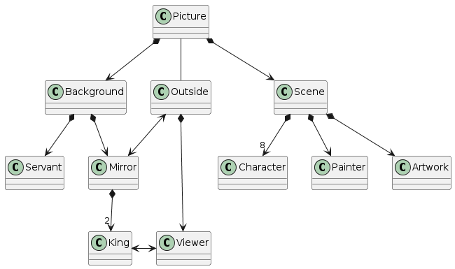
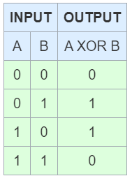
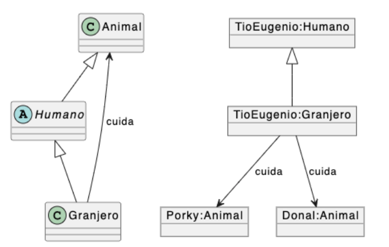
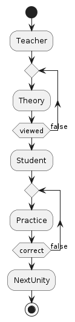
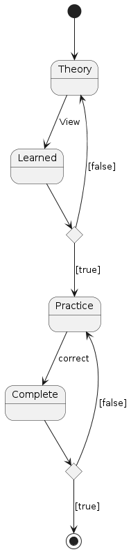

# Cuestionario 4-PlantUML
Universo Santa Tecla - Master en Programación y Diseño Software
[uSantaTecla@gmail.com](mailto:uSantaTecla@gmail.com)  
  

## Ejercicio 1
Modela con UML el cuadro de "Las Meninas de Velázquez" de tal forma que se observe qué diferencias existen con otros cuadros en los que el observador no se siente dentro de la escena (Pista: relaciones entre observador, personajes y posiciones)

### Respuesta

  
  
@startuml  
  
class Picture  
class Background  
Class Outside  
class Scene  
class Viewer  
class Character  
class Servant  
class Painter  
class Artwork  
class King  
class Mirror  
  
Picture *-down-> Background  
Background *-down-> Mirror  
Background *-down-> Servant  
Picture *-down-> Scene  
Scene *-down-> Artwork  
Scene *-down-> Painter  
Scene *-down-> "8" Character  
Picture -down- Outside  
Outside *-down-> Viewer  
Mirror *-down-> "2" King  
King <-right-> Viewer  
Outside <--> Mirror  
  
@enduml   
  

## Ejercicio 2
Dada la tabla de verdad (combinaciones de cierto y falso) de la "puerta" XOR (especificación en tabla verde), escribe la expresión lógica de la salida (tercera columna) correspondiente a la entrada (primeras 2 columnas).

### Respuesta
A XOR B === no A y B o A y no B

  
  

## Ejercicio 3
Comenta la posible incorrección del siguiente diagrama:
  

### Respuesta
"Animal" no hereda características de "Humano", y "Animal" sería una clase Abstracta.
Los nombres deberían estar en inglés.
  
  
  
## Ejercicio 4
Realiza un modelo de este mismo master de Programación y Diseño del Software (Esencial, aproximado, no más de 20 tipos de entidad). Acompaña algún diagrama de actividad o estados para algún proceso.
  
### Respuesta
  
#### Modelo del Master (Diagrama de clases)

@startuml  
  
class MasterDegree  
class Content  
class Theory  
class Practice  
class Teacher  
class Student  
class Unity  
class Exercise  
class Questionnaire  
  
MasterDegree *-down-> Content  
Content *-down-> Unity  
Unity *-down-> Theory  
Unity *-down-> Practice  
Practice <|-down- Exercise  
Practice <|-down- Questionnaire  
Teacher -left-> Content  
Student -left-> Practice  
Student -up.> Theory  
  
@enduml  
  

  
#### Diagrama de actividad
  
@startuml  
  
start  
:Teacher;  
repeat  
  :Theory;  
repeat while (viewed) is (false)  
:Student;  
repeat  
  :Practice;  
repeat while (correct) is (false)  
:NextUnity;  
stop  
  
@enduml  
  

  
#### Diagrama de estados
  
@startuml  
  
state Theory   
State Learned  
state Check <<choice>>  
state Practice  
state Correct <<choice>>  
State Complete  
  
[*] --> Theory  
Theory --> Learned  : View  
Learned --> Check  
Check --> Practice : [true]  
Check --> Theory : [false]  
Practice --> Complete : correct  
Complete --> Correct  
Correct --> [*] : [true]  
Correct --> Practice : [false]  
  
@enduml  
  

  
  
  
## Ejercicio 5
Relaciona, con aproximadamente 50 palabras, las unidades de Patrones y Conocimiento vistos anteriormente.
  
### Respuesta
  
La unidad de "Patrones" nos explica los tipos de elementos que existen, como objetos y clases, unidades y valores, Patrones o modelos, y la unidad de "Conocimiento" nos explica cómo se estructuran y organizan para que por medio de esos datos, construyamos información, que aporte conocimiento y alcance sabiduría: lenguajes formales y expresiones regulares, conjuntos, clases abstractas, Jerarquías de Composición, de Clasficación, de Asociación, etc.