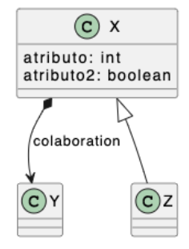

# Cuestionario 5_Complejidad
Universo Santa Tecla - Master en Programación y Diseño Software
[uSantaTecla@gmail.com](mailto:uSantaTecla@gmail.com)  
  
  
## Ejercicio 1
¿La alternativa entre XML, JSON y YAML es una cuestión de eficacia y/o eficiencia? Razona la respuesta y "estima" justificadamente un porcentaje de mejora entre las tres soluciones (p.e. 30% más eficaz, 50% más eficiente, ...)
  
### Respuesta  
  
100% eficiencia: cada uno es una actualización del anterior (XML > JSON > YAML) con la intención de agilizar el proceso de escritura reduciendo recursos, en este caso, optimizando el lenguaje al escribir lo mismo pero utilizando menos símbolos.
  
  
## Ejercicio 2
Edita el yaml correspondiente para la transmisión de esta información:
  
  
### Respuesta  
  
graph:  
    node:  
    - id: X  
    - atributo: int  
    - atributo2: boolean  
    node:  
    - id: Y  
    node:  
    - id: Z  
    edge: colaboration  
    - data: composition  
    - from: X  
      to: Y  
    edge:   
    - data: inherit  
    - from: Z  
      to: X  
    
  
## Ejercicio 3
¿Tendría sentido un documento con estructura de xml cuya información (ubicada entre las etiquetas de abrir y cerrar) respetara a su vez la estructura de json o yaml? Razona la respuesta y, en caso afirmativo, expón un posible escenario.  
  
### Respuesta
No, sería la misma información escrita de tres formas distintas (con diferentes estructuras).    

  
  
  
## Ejercicio 4
Sabiendo que el factorial de 0 es 1 y en cualquier otro caso n es n * factorial(n-1) y que potencia de una base elevado a 0 es 1 y en cualquier otro caso una base elevada a e es b* potencia(b, e-1) y que la suma de un número mas 0 es el número y en cualquier otro caso un numero más n es la suma del siguiente al número más n-1 ... escribe un documento json para estructurar este tipo de definiciones.
  
### Respuesta
  
---------
  

  
## Ejercicio 5  
  
En JSON y YAML existen objetos (colecciones heterogéneas de características) y array (colecciones homogéneas de características). Explica con tus palabras cómo llevar a XML estos conceptos 
  
### Respuesta  
  
Tanto en las colecciones heterogéneas como en las homogéneas, en XML los elementos se escriben "<ejemplo>atributo</ejemplo>", o se pueden abreviar en "</ejemplo>" si no tienen ningún atributo o propiedad.