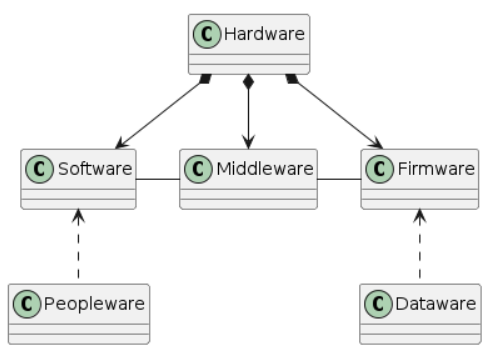

# Cuestionario 5_Complejidad
Universo Santa Tecla - Master en Programación y Diseño Software
[uSantaTecla@gmail.com](mailto:uSantaTecla@gmail.com)  
  
  
## Ejercicio 1
Modela un diagrama de clases que relacione las siguientes palabras clave: software, hardware, firmware, dataware, middleware, peopleware.  
  
### Respuesta  
    
@startuml  
  
class Firmware  
class Software  
class Hardware  
class Dataware  
class Middleware  
class Peopleware  
  
Hardware *-down-> Software  
Hardware *-down-> Firmware  
Hardware *-down-> Middleware  
Middleware -left- Software  
Firmware -left- Middleware  
Peopleware .up.> Software  
Dataware .up.> Firmware  
  
@enduml  
  

  
  
## Ejercicio 2
Comenta en qué medida es correcta la definición de software de la IEEE en el estándar 729: "Es el conjunto de los programas de cómputo, procedimientos, reglas, documentación y datos asociados, que forman parte de las operaciones de un sistema de computación".   
  
### Respuesta  
  
Creo que podrían añadir que el objetivo o finalidad es que un usuario utiliza (explota) ese programa o conjunto de programas.
    
  
## Ejercicio 3

Desarrolla por qué una aplicación de hoja de cálculo es un gestor (altas, bajas, modificaciones y consultas) de un sistema de información.  
  
### Respuesta
Porque no permite más acciones que altas (añadir casillas o información en esas casillas),   
bajas (eliminar esa información o esas casillas),   
modificaciones (cambiar la información, modificar las casillas, los colores y el formato de texto, etc),   
y consultas (leer esa información, compartirla o localizar ciertos datos o información en su contenido).

  
  
  
## Ejercicio 4

A partir de este diagrama, calcula aproximadamente el incremento medio de líneas diarias en photoshop desde la versión 1.0 de 1990 hasta la versión 6.0 de 2020  
[Diagrama Millions of lines of Code](https://informationisbeautiful.net/visualizations/million-lines-of-code/ "[Diagrama Millions of lines of Code")
  
### Respuesta
  
1990: 10.000 líneas  
2020: 4.500.000 líneas  
365 días x 30 años = 10.950 días  
incremento: 10.000 a 4.500.000 = 4.490.000  
4.490.000 líneas / 10.950 días = 410 líneas al día
  
  
## Ejercicio 5  
  
Resume el contenido del tema del Software con aproximadamente 50 palabras.  
  
### Respuesta  
  
Los seres humanos llevan elaborando herramientas desde hace miles de años para automatizar tareas, hasta que en 1812-13, Ada Lovalace y Charles Babbage desarrollan el primer software para aprovechar la altas capacidades cualitativa del ser humano y cuantitativa del hardware. Por medio de lenguajes de programación, evolucionó hasta ser un sistema complejo, cuya elaboración depende de la gestión entre el Ámbito, su coste y su tiempo de elaboración. Es muy importante que un software sea de calidad para que se pueda mantener, modificar o reconstruir a lo largo del tiempo.