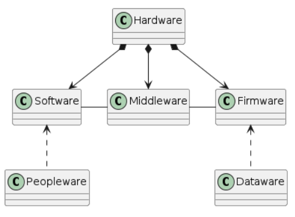

# Cuestionario 5_Complejidad
Universo Santa Tecla - Master en Programación y Diseño Software
[uSantaTecla@gmail.com](mailto:uSantaTecla@gmail.com)  
  
  
## Ejercicio 1
Modela el dominio de las siguientes palabras claves: Restaurante, Comensal, Terraza, Comedor, Desayuno, Comida, Cena, Menú, Carta, Plato, Ingrediente, Cebolla, Trigo, Envío, Crítico, Camarero, Cocinero, Jefe de Cocina, Cocina, Horno, Equipo, Jefe de Personal, Entrevista, Ensayo, Reglas, ...
  
### Respuesta  
    
@startuml  
  
Class Restaurante  
Class Comensal  
Class Terraza  
Class Comedor  
Class Desayuno  
Class Comida  
Class Cena  
Class Menu  
Class Carta  
Class Plato  
Class Ingrediente  
Class Cebolla  
Class Trigo  
Class Envio  
Class Critico  
Class Camarero  
Class Cocinero  
Class JefeCocina  
Class Cocina  
Class Horno  
Class Equipo  
Class JefePersonal  
Class Entrevista  
Class Ensayo  
Class Reglas  
  
  
Restaurante *--> Comedor  
Restaurante *--> Cocina  
Restaurante *--> JefeCocina  
Restaurante *--> JefePersonal  
Cocina -- Comedor  
Cocina --> Envio  
Comedor --Terraza  
JefePersonal -- JefeCocina  
JefePersonal ..> Entrevista  
JefeCocina --> Reglas  
Entrevista --> Equipo  
Reglas --> Equipo  
Equipo *-down-> Cocinero  
Equipo *-down-> Camarero  
Camarero --> Plato  
Comedor *-down-> Comensal  
Terraza *-down-> Comensal  
Comedor *-down-> Critico  
Critico --> Ensayo  
Critico ..> Plato  
Comensal --> Carta  
Carta *--> Plato  
Comida -up-|> Plato  
Cena -up-|> Plato  
Desayuno -up-|> Plato  
Menu -up-|> Plato  
Cocinero ..> Ingrediente  
Cocinero ..> Horno  
Ingrediente <|-- Trigo  
Ingrediente <|-- Cebolla  
Cocinero --> Plato  
  
@enduml  
  

  
  
## Ejercicio 2
Desarrolla, en no más de 50 palabras, una analogía entre la disciplina de requisitos de una aplicación software (requisito funcional, casos de uso/historia de usuario, requisito no funcional, interfaz gráfica y de comunicaciones, ...) y el negocio expuesto anteriormente.
  
### Respuesta  
  
El objetivo de la disciplina de requisitos sería saber cuántos tipos de platos vamos a servir, establecer que en la carta solo va a haber primeros platos, segundos y postres, poner los precios, decir cuánto vamos a tardar, y mostrar a los camareros y cocineros cómo será el servicio. Los requisitos funcionales serían como si piden un plato, se sirve desde cocina, pero si piden bebida se le sirve desde la barra; y los requisitos no funcionales serían la distribución de las mesas, si ponemos salvamanteles, cuántos tenedores, elegir si vasos o copas, etc.
    
  
## Ejercicio 3

Desarrolla, en no más de 50 palabras, una analogía entre la disciplina de análisis y diseño de una aplicación software (modelo, vista, controlador, tecnologías, ...) y el negocio expuesto anteriormente. 
  
### Respuesta
Pues el análisis sería saber donde está la cocina, dónde está la barra, desde dónde el cocinero le da la comida al camarero, o dónde la recoge este para servirla, cuándo se coloca o recoge la terraza, cuantos camareros hay sirviendo y cuántos hay en barra, etc; y el diseño sería saber de donde recogen cada ingrediente los cocineros, de cuánto tiempo disponen para elaborar el plato, por donde entrar las comandas y el orden de prioridad de preparación, cómo se colocan las sillas en la terraza y en cuantas pilas (y de cuantas sillas cada pila) se recogen, etc.
  
  
  
## Ejercicio 4

Desarrolla, en no más de 50 palabras, una analogía entre la disciplina de implementación de una aplicación software (paquetes, clases, unitarias, ...) y el negocio expuesto anteriormente.
  
### Respuesta
  
Creo que la disciplina de implementación del restaurante sería contar y colocar toda la loza, los utensilios de cocina y de los electrodomésticos de la cocina, donde están los cubiertos que se ponen en mesa, los manteles, dónde y cuando se prepara una mesa, etc.
  
  
## Ejercicio 5  
  
Desarrolla, en no más de 50 palabras, una analogía entre la disciplina de pruebas de una aplicación software (fallos, calidad, validación, ...) y el negocio expuesto anteriormente.
  
### Respuesta  
  
La disciplina de pruebas sería realizar diferentes servicios aleatorios, en el mismo momento, de primer y segundo plato, con postre y café, en distintas mesas, y veríamos cuánto se tarda y si llega a tiempo, comprobaríamos la elaboración, si disponemos de los ingredientes, si podemos recojer y servir en el orden correcto los platos, etc.