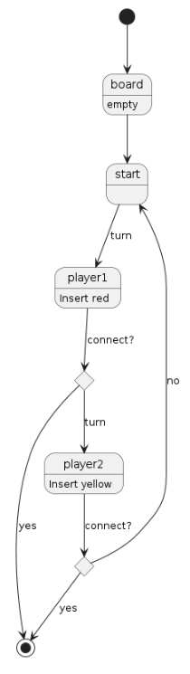

# Connect4
Universo Santa Tecla  
[uSantaTecla@gmail.com](mailto:uSantaTecla@gmail.com)  

## index

## domainModel  

  

[WIKI](https://es.wikipedia.org/wiki/Conecta_4)

[Youtube](https://www.youtube.com/watch?v=JBSbiilzg9U)

Diagrama de estados

  
  
### Código UML  
  
@startuml  
  
state board  
board: empty  
state start  
state player1  
player1 : Insert red  
state checkRed <<choice>>  
state player2  
player2 : Insert yellow  
state checkYellow <<choice>>  
  
[*] --> board  
board -down-> start  
start -down-> player1 : turn  
player1 -down-> checkRed : connect?  
checkRed --> player2 : turn  
checkRed --> [*] : yes  
player2 --> checkYellow : connect?  
checkYellow --> start : no  
checkYellow --> [*] : yes  
   
@enduml  
  
  
  
  
  
 
