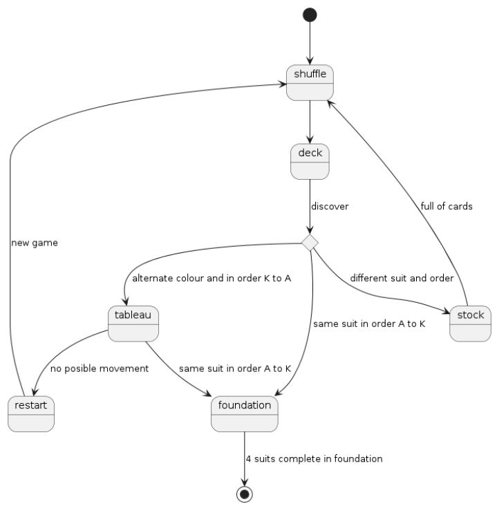

# Connect4
Universo Santa Tecla  
[uSantaTecla@gmail.com](mailto:uSantaTecla@gmail.com)  

## index

## domainModel  

  

Diagrama de estados

  
  
### Código UML  
  
@startuml  
  
state restart  
state shuffle  
state deck  
state moveCard <<choice>>  
state tableau  
state foundation  
state stock  
  
  
[*] --> shuffle  
shuffle -down-> deck  
deck -down-> moveCard: discover  
moveCard -down-> tableau: alternate colour and in order K to A  
moveCard -down-> foundation: same suit in order A to K  
moveCard -down-> stock: different suit and order  
stock --> shuffle: full of cards  
tableau --> foundation: same suit in order A to K  
foundation -down-> [*]: 4 suits complete in foundation  
tableau --> restart: no posible movement  
restart -up-> shuffle: new game  
  
  
@enduml  
  
  
  
  
  
 
