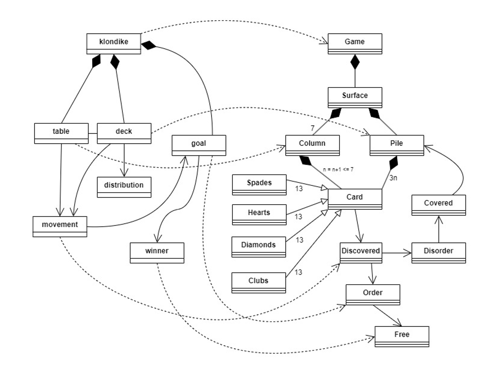
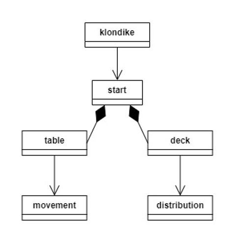
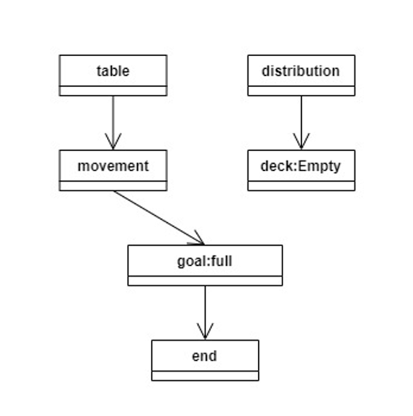

# Klondike
Universo Santa Tecla  
[uSantaTecla@gmail.com](mailto:uSantaTecla@gmail.com)  

## index

* [domainModel](#domainModel)  
    * [vocabulary](#vocabulary)  
    * [initialState](#initialState)  
    * [finalState](#finalState)
    * [instructions](#instructions)  
## domainModel  
  
  

[WIKI](https://es.wikipedia.org/wiki/Solitario_de_cartas)

[Youtube](https://www.youtube.com/watch?v=yjgQXcFVBQY)
### vocabulary

  
  
### initialState  
  
  
  
### finalState 

  
  
### instructions  
  
  
  
  
  
