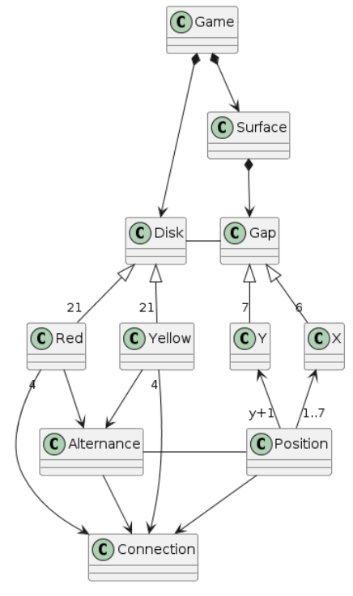

# Connect4
Universo Santa Tecla  
[uSantaTecla@gmail.com](mailto:uSantaTecla@gmail.com)  

## index

* [domainModel](#domainModel)  
    * [vocabulary](#vocabulary)  
    * [initialState](#initialState)  
    * [finalState](#finalState)
    * [instructions](#instructions)  

## domainModel  

  

[WIKI](https://es.wikipedia.org/wiki/Conecta_4)

[Youtube](https://www.youtube.com/watch?v=JBSbiilzg9U)
### Versión propia

  
  
### Código UML  
  
@startuml

class Game  
class Surface  
class Disk  
Class Gap  
Class Red  
Class Yellow  
Class Alternance  
Class Connection  
Class Y  
Class X  
Class Position  
  
  
Game *-down-> Disk  
Disk <|-down- "21" Red  
Disk <|-down- "21" Yellow  
Red -down-> Alternance  
Yellow -down-> Alternance  
Red "4" -down-> Connection  
Yellow "4" -down-> Connection  
Alternance -down-> Connection  
Gap -left- Disk  
Game *-down-> Surface  
Surface *-down-> Gap  
Gap <|-down- "6" X  
Gap <|-down- "7" Y  
X <-down- "1..7" Position  
Y <-down- "y+1" Position  
Alternance -right- Position  
Position -down-> Connection  
  
@enduml  
  
<!-- ### Versión corregida (Grupo) 

  
  
### Código UML  
  
Insertar código  -->
  
  
  
  
  
 
