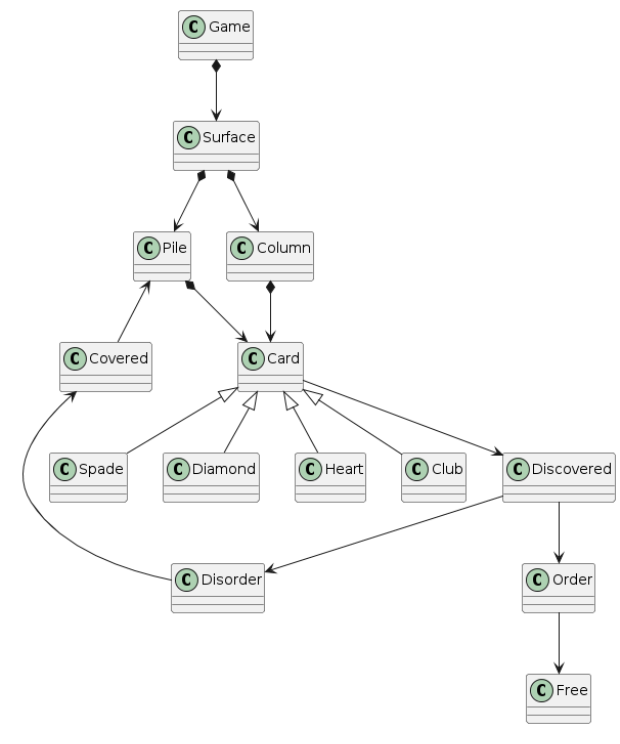

# Klondike
Universo Santa Tecla  
[uSantaTecla@gmail.com](mailto:uSantaTecla@gmail.com)  

## index

* [domainModel](#domainModel)  
    * [vocabulary](#vocabulary)  
    * [initialState](#initialState)  
    * [finalState](#finalState)
    * [instructions](#instructions)  
### Versión propia

  
  
### Código UML  
  
@startuml  
  
class Game  
class Surface  
class Column  
Class Pile  
Class Card  
class Spade  
class Diamond  
class Heart  
class Club  
Class Covered  
Class Discovered  
Class Disorder  
Class Order  
Class Free  
  
Game *-down-> Surface  
Surface *-down-> Column  
Surface *-down-> Pile  
Column *-down-> Card  
Pile *-down-> Card  
Card <|-down- Spade  
Card <|-down- Diamond  
Card <|-down- Heart  
Card <|-down- Club  
Card -down-> Discovered  
Covered -up-> Pile  
Discovered -down-> Disorder  
Disorder -up-> Covered  
Discovered -down-> Order  
Order -down-> Free  
  
@enduml  
  
<!-- ### Versión corregida (Grupo) 

  
  
### Código UML  
  
Insertar código -->
  
  
  
  
  
