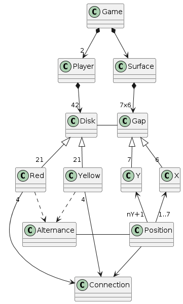

# Connect4
Universo Santa Tecla  
[uSantaTecla@gmail.com](mailto:uSantaTecla@gmail.com)  

## index

## domainModel  

  

[WIKI](https://es.wikipedia.org/wiki/Conecta_4)

[Youtube](https://www.youtube.com/watch?v=JBSbiilzg9U)

Vocabulary

  
  
### Código UML  
  
@startuml  
  
class Game  
class Surface  
class Disk  
Class Gap  
Class Red  
Class Yellow  
Class Alternance  
Class Connection  
Class Y  
Class X  
Class Position  
class Player  
  
  
Game *-down-> "2" Player  
Player *-down-> "42" Disk  
Disk <|-down- "21" Red  
Disk <|-down- "21" Yellow  
Red .down.> Alternance  
Yellow .down.> Alternance  
Red "4" -down-> Connection  
Yellow "4" -down-> Connection  
Gap -left- Disk  
Game *-down-> Surface  
Surface *-down-> "7x6" Gap  
Gap <|-down- "6" X  
Gap <|-down- "7" Y  
X <-down- "1..7" Position  
Y <-down- "nY+1" Position  
Alternance -right- Position  
Position -down-> Connection  
  
@enduml  
  
  
  
  
  
 
